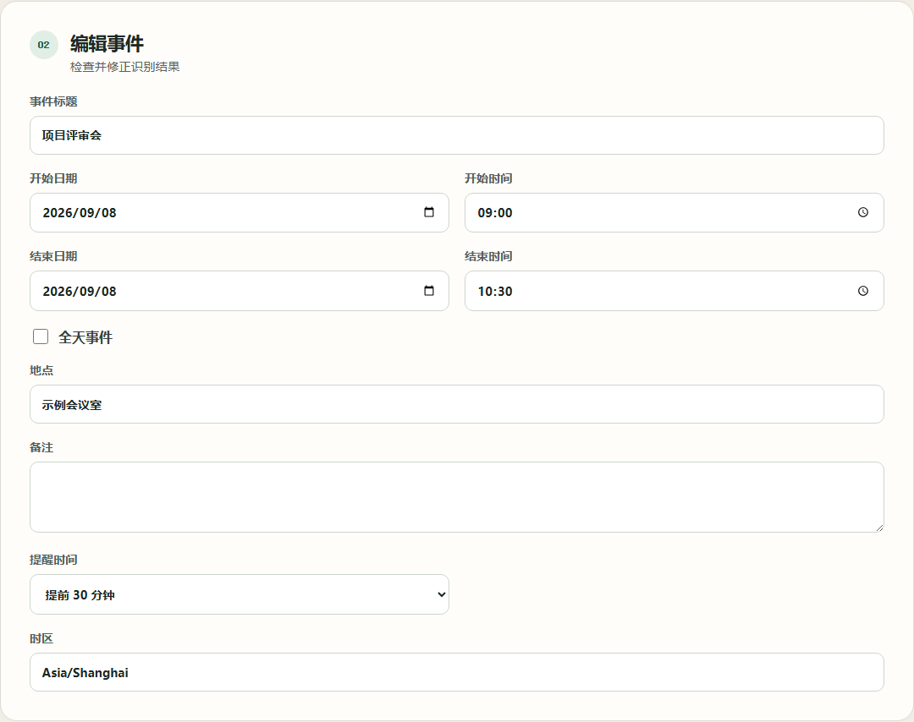
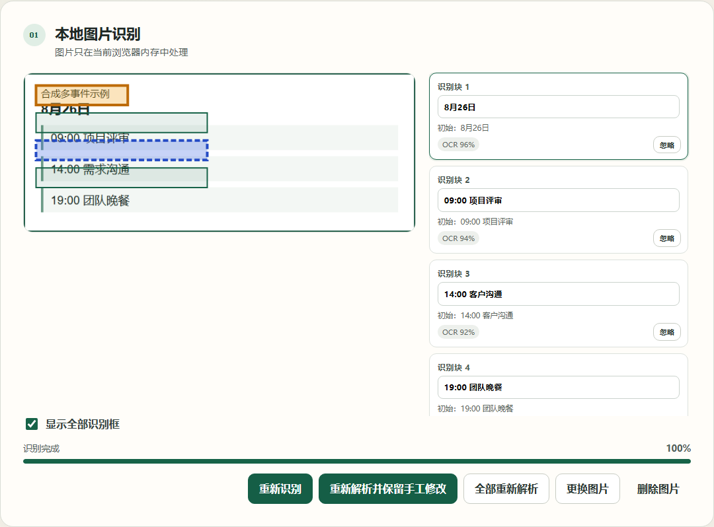
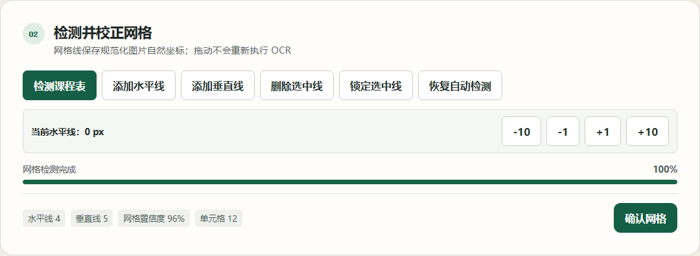
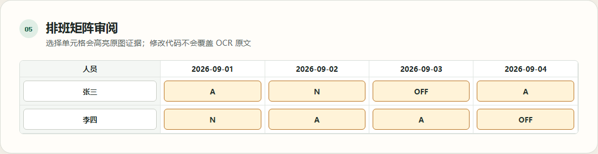
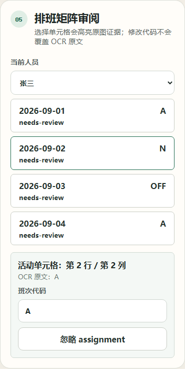

# Snap2Cal

在浏览器本地把事件文字、截图、课程表和人员排班表转换为可核对的 ICS 日历文件。

[English](README.md) | **简体中文**

[](https://github.com/wxgith/snap2cal/actions/workflows/ci.yml)
[](https://github.com/wxgith/snap2cal/actions/workflows/full-verification.yml)
[](https://github.com/wxgith/snap2cal/actions/workflows/pages.yml)
[](LICENSE)

[源码](https://github.com/wxgith/snap2cal) | [问题反馈](https://github.com/wxgith/snap2cal/issues) | [安全策略](https://github.com/wxgith/snap2cal/security/policy) | [发布记录](https://github.com/wxgith/snap2cal/releases) | [Actions](https://github.com/wxgith/snap2cal/actions)

> 隐私优先：用户文字、图片、OCR 结果、课程和排班只保留在当前浏览器标签页。Snap2Cal 没有后端、账号、分析 SDK、远程错误上报或云 OCR。



仓库中的演示姓名、课程、地点和排班均为虚构数据。

## 功能概览

Snap2Cal 有四种输入模式。识别结果只是草稿，用户必须核对和修正字段后再导出。

| 模式     | 输入                     | 用户核对                                         | 输出                  | 当前限制                                         |
| -------- | ------------------------ | ------------------------------------------------ | --------------------- | ------------------------------------------------ |
| 文字事件 | 中文自然语言或结构化列表 | 日期、时间、标题、地点、提醒和候选边界           | 单事件或多事件 `.ics` | 规则以中文为主；不生成重复规则，不推断路程       |
| 图片事件 | 单张 PNG、JPEG 或 WebP   | 本地 OCR 文本、原图证据和事件字段                | 单事件或多事件 `.ics` | 一次一张；印刷体中英文效果较好                   |
| 课程表   | 单张正向、有边框课程表   | 网格、表头、星期、行时间、课程、教学周和排除项   | 每次课程一个 `VEVENT` | 仅支持矩形有边框布局；不编造学校默认值           |
| 排班表   | 单张人员乘日期排班表     | 网格、人员、日期、班次精确映射、跨夜确认和排除项 | 个人或团队 `.ics`     | 仅支持人员行和日期列；不判断工资、考勤或劳动法规 |



## 快速开始

需要 Node.js 24、npm 11，以及支持 Web Worker、WebAssembly、Canvas 和 Blob 下载的现代浏览器。

```bash
npm install
npm run prepare:ocr
npm run verify:ocr
npm run dev
```

打开 Vite 输出的本地地址。剪贴板图片粘贴受浏览器权限和安全上下文限制；粘贴被拒绝时仍可使用文件上传。

### OCR 资源与网络行为

`npm install` 和 `npm run prepare:ocr` 属于构建阶段，需要联网获取 npm 包以及固定的简体中文、英文 Tesseract 语言数据。`prepare:ocr` 会把已安装的 Worker/Core 文件和语言包放入 Git 忽略的 `public/ocr/`，并生成校验清单。

生产应用的 Worker、WASM、语言数据、JavaScript、CSS 和演示图片都从当前站点加载，不回退到第三方 CDN。发布检查会验证运行时网络请求。

## 公开演示

[打开 Snap2Cal 在线演示](https://wxgith.github.io/snap2cal/)。GitHub Pages 从仓库子路径托管同一份静态应用。本地运行方式：

```bash
npm run prepare:ocr
npm run build
npx vite preview
```

[`fixtures/public-demo/`](fixtures/public-demo/) 与 [`public/demo/`](public/demo/) 中的公开演示输入均由脚本生成，只包含合成数据，不含真实日程、排班、聊天、地址、电话、邮箱、标志、头像或二维码。

## 四种模式

### 文字与多事件

可以粘贴单个事件或事件列表。相对日期始终接收应用提供的外部参考时间。低置信度或必填字段无效的候选不会被静默导出，重复候选也不会自动删除。只有稳定 ID、来源区间和原文均一致时，重新检测才会迁移手工修改。

### 图片事件

支持上传或粘贴一张 PNG、JPEG 或 WebP；上限为 8 MiB、单边 8,000 像素和 2,500 万解码像素。OCR 通过 `OcrAdapter` 边界运行。用户编辑 OCR 文本不会覆盖 `originalText`，字段证据继续映射到规范化图片坐标。

不支持 SVG、GIF、HEIC、TIFF、PDF、批量图片。手写、小字号、复杂背景、严重倾斜等输入可能不可靠。

### 课程表



课程表流程先检测矩形网格，再要求确认星期列、行时间、课程单元格、周次、第一教学周星期一和学期周数。只有节次而没有真实时间范围时，对应 occurrence 会被阻止。冲突只提示，不自动删除。每个选中的 occurrence 独立导出为 `VEVENT`，不生成 `RRULE`。

### 排班表



每个非空班次代码都必须由用户精确映射为定时、全天或跳过。结束时间早于开始时间时，只有用户明确确认后才视为跨夜。缺失年份或月份不会从当前日期推断。未知代码、无效日期、冲突和未确认跨夜都会阻止导出。



## ICS 导出

- 单事件复用一个 `VEVENT` 生成器。
- 多事件、课程表和排班表在一个 `VCALENDAR` 中复用同一生成器。
- 课程和班次 occurrence 都是独立事件，本版本不输出 `RRULE`。
- 缺失的日期、时间、地点和提醒会保持缺失，不会编造。
- 导入日历软件前必须核对生成内容。

## 隐私设计

应用运行时：

- 所有处理只发生在浏览器内存；
- 图片、OCR 文字、姓名、课程和排班不会上传或持久化；
- 刷新或关闭页面会丢弃当前输入；
- 临时 Object URL 和 OCR Worker 会释放；
- 下载的 ICS 由浏览器保存到用户设备；
- 应用不发送分析或远程错误上报请求。

GitHub Pages 启用后由 GitHub 提供静态托管，它与 Snap2Cal 的应用逻辑分开。浏览器、操作系统、日历导入、下载和托管服务可能有各自的行为。Issue 和 PR 是公开内容，贡献者必须使用合成或完整脱敏的示例。

详见[隐私与核对说明](docs/privacy.md)。

## 本地开发

```bash
npm ci
npm run prepare:ocr
npm run lint
npm run typecheck
npm run format:check
npm run test
npm run test:e2e
npm run build
```

专项与发布验证：

```bash
npm run verify:ocr
npm run verify:multi-event
npm run verify:schedule-table
npm run verify:shift-roster
npm run test:cross-browser
npm run test:a11y
npm run validate:repo
npm run validate:dist
npm run validate:runtime-network
npm run validate:production-mocks
npm run verify:pages-base
npm run generate:license-report
npm run capture:demo
npm run package:release
npm run validate:release
```

自动化测试使用确定性的合成 Mock。真实 OCR 验证会单独标识，不用 Mock 冒充。生产构建会检查 Mock 适配器和测试开关没有进入产物。

## 架构文档

- [日期解析](docs/date-parsing.md)
- [多事件检测](docs/multi-event-detection.md)
- [候选状态](docs/candidate-state.md)
- [ICS 导出](docs/ics-export.md)
- [OCR 架构](docs/ocr-architecture.md)
- [图片证据映射](docs/image-evidence.md)
- [课程表架构](docs/schedule-table-architecture.md)
- [网格检测](docs/grid-detection.md)
- [课程周次](docs/course-week-patterns.md)
- [课程 occurrence](docs/course-occurrences.md)
- [排班表架构](docs/shift-roster-architecture.md)
- [排班日期映射](docs/roster-date-mapping.md)
- [班次定义](docs/shift-definitions.md)
- [跨夜班次](docs/cross-midnight-shifts.md)
- [排班状态](docs/shift-roster-state.md)

长期架构约束见 [`AGENTS.md`](AGENTS.md)。

## 浏览器支持

发布矩阵在 Chromium 运行完整 E2E，并在 Chromium、Firefox 和 WebKit 运行核心 smoke；视口覆盖桌面 1280px 与移动端 390px。真实 OCR 在 Chromium 验证，其他浏览器 smoke 覆盖导航、动态模块、下载和同源静态资源。不宣称未经验证的最低浏览器版本。

## 已知限制

Snap2Cal 不支持账号、云同步、后端、云 OCR、PDF/Excel/CSV、批量图片、PWA 缓存、原生封装、浏览器扩展、农历、路程、重复日程、工资、考勤或法规判断。OCR、网格检测和日期时间解析都可能出错。课程表不是教务系统真值，排班表不是企业考勤真值。

## 贡献与支持

提交 PR 前请阅读 [`CONTRIBUTING.md`](CONTRIBUTING.md)。[`SUPPORT.md`](SUPPORT.md) 说明如何选择公开渠道。不要公开提交安全漏洞，请遵循 [`SECURITY.md`](SECURITY.md)。未来方向记录在 [`ROADMAP.md`](ROADMAP.md)，不代表交付承诺。

## 许可证

Snap2Cal 使用 [MIT 许可证](LICENSE)。Copyright (c) 2026 xin。其余发布确认和交付前提记录在 [`RELEASE_BLOCKERS.md`](RELEASE_BLOCKERS.md) 与 [`RELEASE_CHECKLIST.md`](RELEASE_CHECKLIST.md)。

第三方组件保留各自许可证，见 [`THIRD_PARTY_NOTICES.md`](THIRD_PARTY_NOTICES.md) 和生成的 [`docs/dependency-licenses.md`](docs/dependency-licenses.md)。
